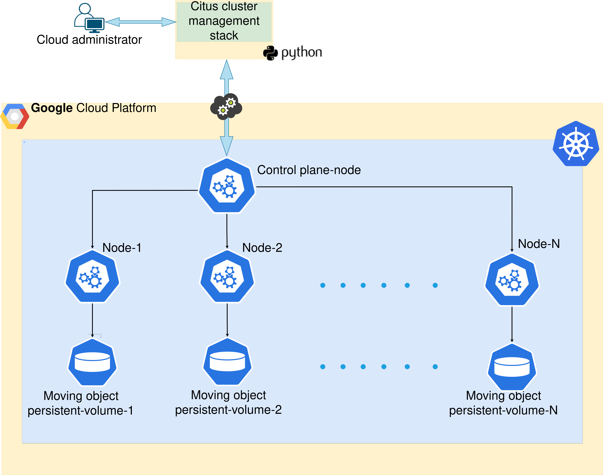
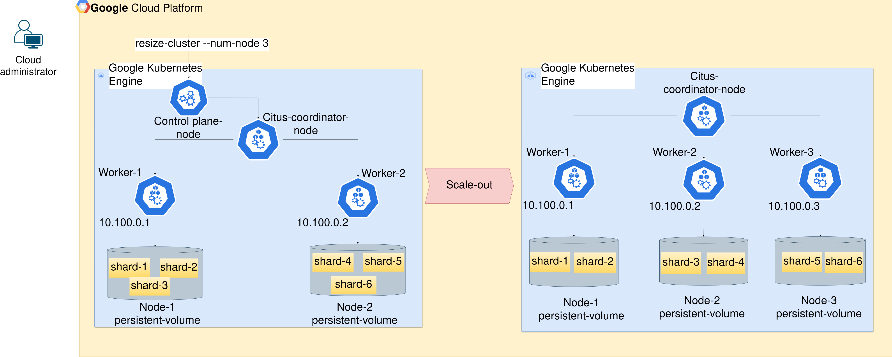

## Scaling Moving Object Database: MobilityDB and Google Kubernetes Engine    
This repository defines an API that enables the scaling of a moving object database within Google Kubernetes Engine (GKE) on Google Cloud Platform (GCP). The PostgreSQL server serves as the relational database management system (RDBMS), supplemented by the MobilityDB extension that efficiently handles the manipulation of moving object data. To learn more about the MobilityDB extension for PostgreSQL, you can refer to the implementation and documentation available at this [link](https://github.com/MobilityDB).
Furthermore, the Citus data extension for PostgreSQL is incorporated to facilitate table partitioning and the efficient distribution of SQL queries across a group of PostgreSQL nodes. To delve into details about the Citus extension, you can explore the complete implementation provided [here](https://github.com/citusdata/citus).

This work has been developed as part of a my master's thesis in computer science. A detailed report can be found [here](https://github.com/MobilityDB/MobilityDB-GCP/blob/master/docs/report/MobilityDB-GCP-Report.pdf).
## Get Started
In this section, we will outline the various steps required to scale a moving object database in GCP. We'll provide a comprehensive guide that details the necessary command-line instructions for each phase. Our process begins with the creation of a GKE cluster, wherein we allocate specific GCP resources. Subsequently, we deploy a PostgreSQL server, complete with the MobilityDB and Citus extensions. Following this, we move forward to initializing the Citus cluster, a step that involves establishing connections between Citus nodes to enable the partitioning of large tables and the distribution of partitions and queries across multiple nodes within the cluster.
The following figure presents an architectural overview of the Citus cluster within the GKE product.

<p align="center">
  
</p>

It is recommended to scale out the cluster when the database becomes large in order to optimize performance. Scaling out involves adding more nodes to the existing cluster. Since PostgreSQL tables are distributed across GKE worker nodes through the Citus extension, adding new nodes triggers the redistribution of tables to evenly distribute partitions across the cluster that incorporates the new nodes. In other words, adding more nodes translates to an increase in computational capacity, including CPU cores and memory. In the event of scale-out or scale-in operations, it is essential to execute the following command to ensure data consistency. This command triggers a Python script designed to automate the redistribution of the cluster when new nodes are added and to manage data evacuation in the event of node deletion.
The figure below illustrates the outcome of the scale-out operation initiated by the Python command that scales the cluster to three nodes.

In the upcoming section, we will provide a tutorial demonstrating the process of deploying a distributed GKE cluster to effectively manage and scale a moving object database analyzed using the MobilityDB extension for PostgreSQL. We will present the required commands to achieve this. 
## Tutorial
In this tutorial, we will create a workflow that outlines the necessary steps to deploy a GKE cluster, aiming to establish a distributed environment for a PostgreSQL database.
### GKE Cluster Initialization
First and foremost, you need to possess a Google account to link it within the GCP console. If you already have an existing Google account, you can associate it with GCP by signing in here[](https://console.cloud.google.com).
Once you have a GCP account, it's necessary to acquire credits to utilize GCP services through the billing account. For further information about GCP credits and billing accounts, please refer to this link[](https://console.cloud.google.com/billing).
Next, the subsequent steps detail the process of setting up a GKE cluster.
- Create GCP project
Once you have created the billing account with active credits on it, create GCP project and associate the billing account with it. The project can be created through the GCP console or by commands line from your local machine. You can find the full documentation on how to create GCP project in this link[](https://cloud.google.com/resource-manager/docs/creating-managing-projects?hl=en#gcloud}).
The following command creates a GCP project with the desired PROJECT_ID.
```bash
gcloud projects create PROJECT_ID
```  
- Enable GKE product
Enabling GKE product through the activation process here[](https://cloud.google.com/kubernetes-engine/docs/how-to/workload-identity) 
- Create GKE cluster.
Creating GKE cluster with the full understanding of it parameters, you can visit the documentation in this link[](https://cloud.google.com/kubernetes-engine/docs/how-to/workload-identity#enable_on_cluster). Or use the following command with the necessary parameters for our cluster.
```bash 
gcloud container clusters create mobilitydb-cluster --zone europe-west1-c
--node-pool mobilitydb-node-pool --machine-type e2-standard-4
--disk-type pd-balanced --num-nodes 4
```
- Connect to GKE cluster.
We assume that the kubectl Kubernetes client is already installed. 
```bash
# Get the credentials of the cluster
gcloud container clusters get-credentials mobilitydb-cluster
--zone europe-west1-c --project PROJECT_ID
# View your cluster information
gcloud container clusters describe mobilitydb-cluster-1
--zone europe-west1-c 
# You should see your cluster created after few 
# minutes in your GCP console
# View your cluster nodes information via the kubectl command
kubectl get node -o wide
```
### Citus Cluster Initialization
Once the GKE cluster is established, you can deploy our cloud-native solution to initialize the Citus cluster. To accomplish this, you must first perform the following operations.
- Clone MobilityDB-GCP solution.
```bash       
git clone https://github.com/MobilityDB/MobilityDB-GCP
```
- Metadata configuration
Adapt the file postgres-secret.yaml to update your confidential information including POSTGRES_USER, POSTGRES_PASSWORD and POSTGRES_DB and POSTGRES_PORT.
- Export your environment variables
```bash   
export POSTGRES_USER=your-user
export POSTGRES_PASSWORD=your-password
export POSTGRES_DB=your-db-name
export POSTGRES_PORT=30001
source ~/.bashrc
```
- Clone the cloud native solution in the docker registry
```bash
# Create the docker registry in GCP artifact registry
gcloud artifacts repositories create  repo-test --repository-format=docker
--location=europe-west1 --description==testing --immutable-tags --async
# Pull the cloud native docker image from the docker hub
docker pull bouzouidja/mobilitydb-cloud:latest
# Tag the pulled docker image mobilitydb-cloud into the docker
# registry repo-test
docker tag bouzouidja/mobilitydb-cloud:latest europe-west1-docker.pkg.dev/
PROJECT_ID/repo-test/mobilitydb-cloud:latest
# Push the taged image to the  repo-test docker registry
docker push bouzouidja/mobilitydb-cloud:latest europe-west1-docker.pkg.dev/
PROJECT_ID/repo-test/mobilitydb-cloud:latest
```
- Open the port 30001 to accept requests from the outside of the GKE cluster.
```bash
gcloud compute firewall-rules create mobilitydb-node-port
--project PROJECT_ID --allow tcp:30001
```
- Deploy the application YAML files.
```bash
# Execute those commands simultaneously, and wait until the Pods will
# be in the running state
kubectl create -f postgres-secret.yaml
kubectl create -f coordinator-deployment.yaml
kubectl create -f workers-deployment.yaml
# View your Pods
kubectl get pods -o wide
# You should see the coordinator Pod and the workers Pods running
```
- Test your PostgreSQL within GKE cluster.    
```bash
# Access to your PostgreSQL database from the coordinator using
# the psql client
psql -h 34.34.151.202 -U docker -p 30001 -d mobilitydb
mobilitydb=#
```
34.34.151.202 is the external IP address of the coordinator node in my created cluster, it can be found using the command.
```bash
kubectl get node -o wide
NAME STATUS ROLES AGE VERSION  INTERNAL-IP EXTERNAL-IP      OS-IMAGE
KERNEL-VERSION  CONTAINER-RUNTIME
gke-mobilitydb-clust-mobilitydb-node--77a55075-cssr   Ready    <none>   121m   v1.27.3-gke.100   10.132.15.217   34.34.151.202    Container-Optimized OS
from Google   5.15.109+        containerd://1.7.0
gke-mobilitydb-clust-mobilitydb-node--77a55075-l2wd   Ready    <none>   121m   v1.27.3-gke.100   10.132.15.220   35.187.85.28     Container-Optimized OS
from Google   5.15.109+        containerd://1.7.0
gke-mobilitydb-clust-mobilitydb-node--77a55075-ldgc   Ready    <none>   121m   v1.27.3-gke.100   10.132.15.219   34.77.253.167    Container-Optimized OS
from Google   5.15.109+        containerd://1.7.0
gke-mobilitydb-clust-mobilitydb-node--77a55075-wcl8   Ready    <none>   121m   v1.27.3-gke.100   10.132.15.218   35.205.205.195   Container-Optimized OS
from Google   5.15.109+        containerd://1.7.0
```
- View the worker nodes information.         
```bash       
mobilitydb=# SELECT * from citus_get_active_worker_nodes();
 node_name  | node_port 
------------+-----------
 10.48.1.15 |      5432
 10.48.2.8  |      5432
 10.48.3.7  |      5432
(3 rows)
```
### Horizontal Scaling Command
The command below initiates a resizing operation of the current cluster by providing the appropriate parameters. 
```bash       
# Make sure to export your environment variables, including POSTGRES_USER,
# POSTGRES_PASSWORD, POSTGRES_PORT and POSTGRES_DB. 
python citus_cluster_management.py resize --cluster-name mobilitydb-cluster-1
--cluster-zone europe-west1-b --cluster-project PROJECT_ID --num-nodes 8
# Waiting the completion of all operations.
```